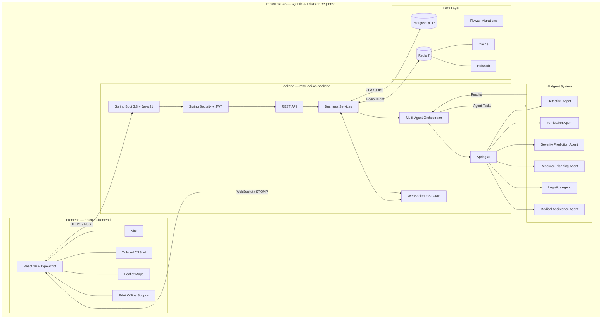

<div align="center">

# 🚨 RescueAI OS

### *Agentic AI Operating System for Disaster Intelligence, Coordination & Autonomous Decision Support*

[](https://openjdk.org/)
[](https://spring.io/projects/spring-boot)
[](https://react.dev/)
[](https://www.typescriptlang.org/)
[](https://www.postgresql.org/)
[](https://redis.io/)
[](https://docs.docker.com/compose/)
[](https://web.dev/progressive-web-apps/)
[](LICENSE)

> **RescueAI OS** is a full-stack, production-grade emergency response platform powered by a **multi-agent AI pipeline**. Eight autonomous AI agents work in concert to detect, verify, triage, and coordinate disaster response — all in real-time. Powered by **Google Gemini 2.0 Flash**, live OpenStreetMap, real weather data, and browser push notifications.

</div>

---

## 📋 Table of Contents

- [Overview](#-overview)
- [Architecture](#-architecture)
- [AI Agent Pipeline](#-ai-agent-pipeline)
- [Tech Stack](#-tech-stack)
- [Design System](#-design-system-and-theme)
- [Project Structure](#-project-structure)
- [Database Schema](#-database-schema)
- [Getting Started](#-getting-started)
- [Environment Variables](#-environment-variables)
- [API Documentation](#-api-documentation)
- [Key Features](#-key-features)
- [Contributing](#-contributing)
- [License](#-license)

---

## 🌐 Overview

**RescueAI OS** is designed to serve disaster response command centers, giving operators a unified, real-time view of ongoing emergencies, resource allocation, hospital capacity, and volunteer deployment.

### How It Works

When a citizen or field operator submits an incident report, the system's **AgentOrchestrator** routes it through eight specialized AI agents in sequence — each powered by **Google Gemini 2.0 Flash** (or any OpenAI-compatible LLM / local Ollama model):

1. **Detect** — Classify the emergency type from raw natural-language text
2. **Verify** — Cross-validate, de-duplicate, and assign a confidence score
3. **Predict** — Score severity (1–10) and estimate spread radius in metres
4. **Plan** — Select optimal ambulances, trucks, and helicopters from the available fleet
5. **Triage** — Match the nearest hospitals by specialty and bed capacity
6. **Assess** — Evaluate road blockages, utility failures, and evacuation routes
7. **Route** — Coordinate supply chains, fuel, and relief material logistics
8. **Broadcast** — Draft multilingual public alerts across SMS, push, and radio channels

All agent decisions are **fully auditable** — stored with input/output JSON, confidence scores, latency, and human-override logs.

> **No backend? No problem.** When the Spring Boot API is unreachable, the frontend automatically switches to **Demo Simulation mode** — realistic mock incidents, hospitals, volunteers, and a live-animated agent pipeline — so the full UI/UX can be evaluated without running any servers.

---

## 🏗️ Architecture

```
┌─────────────────────────────────────────────────────────────────────┐
│                          RescueAI Monorepo                          │
│                                                                     │
│   ┌──────────────────────────┐   ┌───────────────────────────────┐  │
│   │    rescueai-frontend     │   │     rescueai-os-backend       │  │
│   │  React 19 + TypeScript   │◄─►│  Spring Boot 3.3 + Java 21   │  │
│   │  Vite · Tailwind CSS v4  │   │  Spring AI · WebSocket/STOMP  │  │
│   │  Leaflet · PWA Offline   │   │  JWT Auth · Multi-tenant      │  │
│   └──────────────────────────┘   └──────────────┬────────────────┘  │
│                                                  │                  │
│                                ┌─────────────────▼──────────────┐   │
│                                │     PostgreSQL 16 (Flyway)      │   │
│                                │     Redis 7   (cache/pub-sub)   │   │
│                                └────────────────────────────────┘   │
└─────────────────────────────────────────────────────────────────────┘
```

## 🏗️ RescueAI OS Architecture



The system uses a **multi-tenant** architecture — each organisation (state disaster authority, fire department, NGO) is an isolated `Tenant` with its own users, incidents, resources, and hospitals.

---

## 🤖 AI Agent Pipeline

| # | Agent | Responsibility |
|---|-------|----------------|
| 1 | **EmergencyDetectionAgent** | Classify incident type (flood, fire, earthquake, cyclone…) from raw text |
| 2 | **VerificationAgent** | Cross-validate reports, detect duplicates, assign confidence score |
| 3 | **SeverityPredictionAgent** | Score severity 1–10 and predict spread radius in metres |
| 4 | **ResourcePlannerAgent** | Select optimal ambulances, fire trucks, helicopters from available fleet |
| 5 | **MedicalAgent** | Match nearest hospitals by specialty and capacity; recommend triage protocol |
| 6 | **InfrastructureAgent** | Assess road blockages, utility failures, evacuation route viability |
| 7 | **LogisticsAgent** | Coordinate supply chains, fuel depots, and relief material routing |
| 8 | **CommunicationAgent** | Draft multilingual public alerts for SMS, push, and broadcast channels |

Each agent:
- Calls **Gemini 2.0 Flash** (or any configured LLM) and returns structured JSON
- Produces an `AgentResult` with `summary`, `confidence` (0–1), and `latencyMs`
- Is persisted to the `agent_actions` table for a full, immutable audit trail
- Supports **human override** — an operator can override any decision with a reason log

---

## 🛠️ Tech Stack

### Frontend

| Technology | Version | Purpose |
|------------|---------|---------|
| **React** | 19 | Core UI framework |
| **TypeScript** | ~6.0 | Type-safe development |
| **Vite** | 8.x | Build tool and dev server with HMR |
| **Tailwind CSS** | v4 | Utility-first styling (PostCSS plugin) |
| **React Router DOM** | v7 | Client-side routing |
| **Recharts** | 3.x | Responsive charts and analytics |
| **Leaflet.js** | 1.x | Interactive OpenStreetMap tile-based map |
| **Axios** | 1.x | HTTP client for REST API calls |
| **@stomp/stompjs** | 7.x | STOMP protocol over WebSocket |
| **SockJS Client** | 1.x | WebSocket fallback transport |
| **Lucide React** | 1.x | Clean, consistent icon set |
| **vite-plugin-pwa** | 1.x | PWA service worker + offline tile caching |
| **clsx** | 2.x | Conditional class name composition |
| **oxlint** | 1.x | Fast Rust-based linter |

### Backend

| Technology | Version | Purpose |
|------------|---------|---------|
| **Java** | 21 (LTS) | Core language |
| **Spring Boot** | 3.3.4 | Application framework |
| **Spring AI** | 1.0.0-M6 | LLM integration (OpenAI / Ollama / Gemini) |
| **Spring Security** | 6.x | JWT-based stateless authentication |
| **Spring Data JPA** | 3.x | ORM / repository layer |
| **Spring WebSocket** | 3.x | Real-time alert broadcasting via STOMP |
| **Spring Cache** | 3.x | Application-level caching layer |
| **Spring Actuator** | 3.x | Health checks and metrics endpoints |
| **Spring Validation** | 3.x | Bean Validation (JSR-380) |
| **PostgreSQL Driver** | 16 | Primary relational database |
| **Flyway** | latest | Database schema version control |
| **Redis** | 7 | Caching and pub/sub messaging |
| **JJWT** | 0.12.6 | JWT creation and validation |
| **Lombok** | 1.18.46 | Boilerplate reduction |
| **SpringDoc OpenAPI** | 2.6.0 | Auto-generated Swagger UI |
| **OpenAI Spring AI Starter** | M6 | OpenAI / Gemini-compatible LLM calls |
| **Ollama Spring AI Starter** | M6 | Local LLM support (Llama 3, Gemma, Mistral) |

### Infrastructure

| Technology | Purpose |
|------------|---------|
| **Docker** | Container runtime |
| **Docker Compose** | Multi-service orchestration (Postgres + Redis + App) |
| **PostgreSQL 16** | Primary RDBMS (Alpine image) |
| **Redis 7** | Cache and real-time pub/sub (Alpine image) |
| **Maven** | Java build system |
| **Google Fonts** | Rajdhani · Inter · JetBrains Mono |

---

## 🎨 Design System and Theme

The frontend uses a custom **Emergency Command Centre** design — clinical white backgrounds with high-contrast signal-red accents that evoke urgency without causing fatigue during long monitoring sessions.

### Colour Palette

| Token | Hex | Usage |
|-------|-----|-------|
| `--color-void` | `#ffffff` | Base background |
| `--color-charcoal` | `#fafafa` | Secondary background |
| `--color-steel` | `#f5f5f5` | Card surfaces |
| `--color-line` | `#e8e8e8` | Borders / dividers |
| `--color-signal` | `#dc2626` | Primary accent — alerts, CTAs |
| `--color-signal-bright` | `#ef4444` | Hover / active states |
| `--color-signal-dim` | `#fca5a5` | Muted accent |
| `--color-signal-glow` | `#ff6b6b` | Gradient terminus |
| `--color-rose-light` | `#fff1f2` | Subtle tinted backgrounds |
| `--color-rose-border` | `#fecdd3` | Accent border on hover |
| `--color-bone` | `#1a1a1a` | Primary text |
| `--color-ash` | `#6b7280` | Secondary / muted text |

### Typography

| Font | Weight | Role |
|------|--------|------|
| **Rajdhani** | 500 · 600 · 700 | Display headings, HUD labels |
| **Inter** | 400 · 500 · 600 · 700 | Body copy, UI text |
| **JetBrains Mono** | 400 · 500 · 600 | Code, IDs, coordinates, timestamps |

### UI & Animation Patterns

| Pattern | Description |
|---------|-------------|
| **HUD Panels** | Cards with animated corner brackets that expand on hover (targeting-reticle motif) |
| **Background Orbs** | Soft red radial blobs drifting via `orb-drift` keyframe (18 s loop) |
| **Pulse Dot** | Live status indicators with radiating ring animation (`pulse-ring`) |
| **Shimmer Loader** | Rose-tinted skeleton for loading states |
| **Grid Texture** | Subtle 32 × 32 px red grid lines as background texture |
| **Stat Accent Bar** | 3 px gradient bar slides from the top of stat cards on hover |
| **Nav Active Glow** | Inset left-border red glow on the active sidebar item |
| **Float Up** | Cards animate upward on mount (`float-up` keyframe) |
| **Badge Pop** | Elastic spring-scale animation on badge render |
| **Ping Live** | Pulsing box-shadow on live status badges |

---

## 📁 Project Structure

```
RescueAI/
├── rescueai-frontend/                   # React + TypeScript SPA
│   ├── src/
│   │   ├── components/
│   │   │   ├── AgentPipeline.tsx        # Live 8-agent orchestration DAG visualiser
│   │   │   ├── AppShell.tsx             # Sidebar + header (weather widget + notifications)
│   │   │   ├── Badges.tsx               # Severity / status badge components
│   │   │   ├── EmergencyCallPanel.tsx   # One-tap emergency call buttons (NDRF, Coast Guard…)
│   │   │   ├── EmergencyToast.tsx       # Full-screen critical alert toast overlay
│   │   │   ├── NotificationCenter.tsx   # Bell icon + unread badge + notification dropdown
│   │   │   ├── Panel.tsx                # Reusable HUD panel wrapper with corner brackets
│   │   │   ├── TacticalMap.tsx          # Leaflet OSM map with incident / hospital / GPS overlays
│   │   │   ├── VolunteerTracker.tsx     # Live GPS sharing via Geolocation API (pulsing dot)
│   │   │   └── WeatherWidget.tsx        # Live weather + disaster risk badge (LOW → CRITICAL)
│   │   ├── pages/
│   │   │   ├── Dashboard.tsx            # Command centre — AI pipeline, media upload, incident feed
│   │   │   ├── Alerts.tsx               # Emergency broadcast form + alert history
│   │   │   ├── Analytics.tsx            # 6 real-data charts (heatmap, donut, radar…)
│   │   │   ├── Hospitals.tsx            # Hospital capacity and nearest-hospital routing
│   │   │   ├── IncidentTimeline.tsx     # Per-incident agent audit timeline
│   │   │   ├── LiveMap.tsx              # Full-screen map + GPS tracker + emergency dial
│   │   │   ├── Login.tsx                # JWT authentication flow
│   │   │   ├── Resources.tsx            # Fleet and resource management
│   │   │   └── Volunteers.tsx           # Volunteer dispatch console
│   │   ├── context/
│   │   │   └── DataContext.tsx          # Global state — incidents, notifications, GPS, alerts
│   │   ├── lib/
│   │   │   ├── api.ts                   # Axios REST client (all backend endpoints)
│   │   │   ├── gemini.ts                # Gemini 2.0 Flash AI integration + fallback
│   │   │   ├── mock.ts                  # Demo-mode seed data + simulated agent pipeline
│   │   │   ├── notifications.ts         # Web Notifications API wrapper (push alerts)
│   │   │   ├── weather.ts               # OpenWeatherMap API client + risk assessment
│   │   │   └── ws.ts                    # STOMP / SockJS WebSocket client
│   │   ├── types/
│   │   │   └── index.ts                 # All TypeScript interfaces mirroring backend DTOs
│   │   ├── App.tsx                      # Router and app entry point
│   │   └── index.css                    # Global design system, CSS tokens, animations
│   ├── .env.example                     # Environment variable template
│   ├── vite.config.ts                   # Vite + PWA plugin configuration
│   ├── tsconfig.json
│   └── package.json
│
├── rescueai-os-backend/                 # Spring Boot API
│   ├── src/main/java/com/rescueai/os/
│   │   ├── agent/
│   │   │   ├── Agent.java               # Agent interface contract
│   │   │   ├── AgentContext.java        # Shared context object passed through pipeline
│   │   │   ├── AgentOrchestrator.java   # Runs the 8-agent sequential pipeline
│   │   │   ├── AgentResult.java         # Structured agent output wrapper
│   │   │   └── impl/                    # 8 concrete agent implementations
│   │   ├── ai/
│   │   │   ├── LlmClient.java           # LLM abstraction interface
│   │   │   └── impl/SpringAiLlmClient   # Spring AI implementation (OpenAI / Ollama)
│   │   ├── controller/                  # REST controllers (@RestController)
│   │   ├── domain/
│   │   │   ├── entity/                  # JPA entities (Incident, Hospital, Resource…)
│   │   │   └── enums/                   # Type-safe enumerations
│   │   ├── dto/                         # Request / Response DTOs
│   │   ├── repository/                  # Spring Data JPA repositories
│   │   ├── security/                    # JWT filter, UserDetails, SecurityConfig
│   │   ├── service/                     # Business logic layer
│   │   ├── config/                      # Async, WebSocket, Security config beans
│   │   └── websocket/                   # STOMP alert broadcaster
│   ├── src/main/resources/
│   │   ├── application.yml              # App config (fully env-var driven)
│   │   └── db/migration/
│   │       ├── V1__init_schema.sql      # Full schema definition
│   │       └── V2__seed_demo_data.sql   # Demo tenant + seeded sample data
│   ├── Dockerfile
│   ├── docker-compose.yml
│   └── pom.xml
│
└── README.md
```

---

## 🗄️ Database Schema

Schema is managed by **Flyway** and lives in `V1__init_schema.sql`.

```
tenants ──┬── users ──────────── volunteers
          │
          ├── incidents ─────────┬── incident_reports
          │                      ├── agent_actions      ← full AI audit trail
          │                      ├── alert_broadcasts
          │                      └── resources (assigned_to)
          │
          ├── hospitals
          ├── resources
          └── sop_documents
```

**Key design decisions:**

| Decision | Detail |
|----------|--------|
| **UUID primary keys** | Safe for distributed generation across replicas |
| **Multi-tenant isolation** | `tenant_id` foreign key on every business table |
| **Geospatial fields** | `latitude` / `longitude` on incidents, hospitals, resources, and users |
| **AI audit trail** | `agent_actions` stores every LLM call with `confidence`, `latency_ms`, `overridden` flag |
| **pgcrypto extension** | Enabled for UUID generation in raw SQL seed files |

---

## 🚀 Getting Started

### Prerequisites

- **Docker + Docker Compose** — recommended for the full stack
- Or for manual setup: **Java 21**, **Node.js 20+**, **PostgreSQL 16**, **Redis 7**

### Quick Start with Docker

```bash
# 1. Clone the repository
git clone https://github.com/RuchikaaVerma/RescueAI.git
cd RescueAI

# 2. Configure the backend
cp rescueai-os-backend/.env.example rescueai-os-backend/.env
# Edit .env and set: AI_API_KEY, AI_BASE_URL, AI_MODEL, JWT_SECRET

# 3. Start Postgres + Redis + Spring Boot API
cd rescueai-os-backend
docker compose up --build -d

# 4. Start the React frontend (new terminal)
cd ../rescueai-frontend
cp .env.example .env.local
# Optional: add VITE_GEMINI_API_KEY and VITE_WEATHER_API_KEY to .env.local
npm install
npm run dev
```

| Service | URL |
|---------|-----|
| **Frontend** | http://localhost:5173 |
| **Backend API** | http://localhost:8081 |
| **Swagger UI** | http://localhost:8081/swagger-ui.html |

> **Demo mode:** If you skip the backend setup entirely, the frontend still runs in full demo simulation mode — no backend required to evaluate the UI.

### Local Development

#### Backend only

```bash
cd rescueai-os-backend

# Start only Postgres + Redis
docker compose up postgres redis -d

# Run Spring Boot (Linux/macOS)
./mvnw spring-boot:run

# Run Spring Boot (Windows)
mvnw.cmd spring-boot:run
```

#### Frontend only

```bash
cd rescueai-frontend
npm install
npm run dev        # Dev server at http://localhost:5173 with HMR
npm run build      # Production build → dist/
npm run preview    # Preview production build locally
npm run lint       # Run oxlint
```

---

## 🔑 Environment Variables

### Backend — `rescueai-os-backend/.env`

| Variable | Default | Description |
|----------|---------|-------------|
| `DB_HOST` | `localhost` | PostgreSQL host |
| `DB_PORT` | `5432` | PostgreSQL port |
| `DB_NAME` | `rescueai_os` | Database name |
| `DB_USER` | `rescueai` | DB username |
| `DB_PASSWORD` | `rescueai` | DB password |
| `REDIS_HOST` | `localhost` | Redis host |
| `REDIS_PORT` | `6379` | Redis port |
| `AI_PROVIDER` | `openai` | `openai` or `ollama` |
| `AI_API_KEY` | *(required)* | OpenAI / Gemini API key |
| `AI_BASE_URL` | `https://api.openai.com` | LLM endpoint base URL |
| `AI_MODEL` | `gpt-4o-mini` | Model identifier string |
| `OLLAMA_BASE_URL` | `http://localhost:11434` | Ollama endpoint (local LLMs) |
| `OLLAMA_MODEL` | `llama3` | Local model name |
| `JWT_SECRET` | *(change in prod)* | HS256 signing secret |
| `JWT_EXPIRATION_MS` | `86400000` | Token TTL — 24 hours |

> **LLM-agnostic tip:** Point `AI_BASE_URL` at Google Gemini's OpenAI-compatible endpoint to use Gemini models. Set `AI_PROVIDER=ollama` to run fully offline with Llama 3, Gemma, Mistral, Phi-3, or DeepSeek.

### Frontend — `rescueai-frontend/.env.local`

| Variable | Default | Description |
|----------|---------|-------------|
| `VITE_API_BASE_URL` | `http://localhost:8081` | Backend REST base URL |
| `VITE_WS_URL` | `http://localhost:8081/ws` | WebSocket endpoint |
| `VITE_GEMINI_API_KEY` | *(optional)* | Google Gemini key — enables real AI pipeline in browser |
| `VITE_WEATHER_API_KEY` | *(optional)* | OpenWeatherMap key — enables live weather widget |

> Both frontend keys are **optional**. Without them the app falls back to realistic demo/mock simulation automatically.

---

## 📖 API Documentation

- **Swagger UI** → `http://localhost:8081/swagger-ui.html`
- **OpenAPI JSON** → `http://localhost:8081/v3/api-docs`

### Core REST Endpoints

| Method | Path | Description |
|--------|------|-------------|
| `POST` | `/api/v1/auth/register` | Register a new user |
| `POST` | `/api/v1/auth/login` | Obtain a JWT bearer token |
| `POST` | `/api/v1/incidents/report` | Submit incident → triggers 8-agent AI pipeline |
| `GET` | `/api/v1/incidents` | List all incidents (paginated, filterable) |
| `GET` | `/api/v1/incidents/{id}` | Get incident detail + full agent action log |
| `GET` | `/api/v1/hospitals` | List hospitals with live bed capacity |
| `PATCH` | `/api/v1/hospitals/{id}/load` | Update hospital load in real time |
| `GET` | `/api/v1/resources` | List available resources by type |
| `GET` | `/api/v1/volunteers/available` | List currently available volunteers |
| `GET` | `/api/v1/agents/incidents/{id}/actions` | Full AI pipeline output for an incident |
| `PATCH` | `/api/v1/agents/actions/{id}/override` | Human-override an agent decision with reason |

### WebSocket (STOMP)

Connect to `/ws` and subscribe to:

| Topic | Payload |
|-------|---------|
| `/topic/incidents` | New incident reports (all operators) |
| `/topic/agent-pipeline/{incidentId}` | Live agent step updates for an incident |
| `/topic/alerts` | Emergency broadcast alerts |

---

## ✨ Key Features

### Core Platform
- 🤖 **8-Agent AI Pipeline** — Fully autonomous: detection → verification → severity → resources → medical → infrastructure → logistics → communications
- ✨ **Gemini 2.0 Flash AI** — Real AI analysis powers every agent step; gracefully falls back to simulation if unavailable
- 🔴 **Real-Time Dashboard** — Live incident feed, active emergency count, resource utilisation stats
- 🔐 **JWT Authentication** — Stateless, role-based access: Admin, Operator, Responder, Volunteer
- 🏢 **Multi-Tenant** — Full data isolation per organisation on a shared deployment
- 📝 **Full Audit Trail** — Every AI agent decision stored with confidence score, latency, and override log

### Mapping & Location
- 🗺️ **Interactive Tactical Map** — Leaflet + OpenStreetMap with incident, hospital, resource, and GPS overlays
- 📍 **Volunteer GPS Tracking** — Share real GPS position; appears as pulsing blue dot on the live map
- 🧭 **Navigate to Incident** — One-click "Open in Google Maps" navigation from any incident

### Alerting & Communication
- 🔔 **In-App Notification Center** — Bell icon with unread badge; dropdown lists all critical events and alert history
- 📲 **Browser Push Notifications** — Critical incident alerts appear even when the tab is minimised or the screen is locked
- 📢 **Emergency Broadcast** — Multi-channel alert form: SMS, push, in-app, email, public announcement
- 📞 **Emergency Calling** — One-tap direct dial to NDRF, Coast Guard, district HQs, and hospitals

### Field Operations
- 🏥 **Hospital Routing** — Capacity-aware nearest-hospital recommendation with specialty matching
- 🚑 **Resource Management** — Fleet tracking for ambulances, fire engines, helicopters, water tankers
- 🧑‍🤝‍🧑 **Volunteer Dispatch** — Skill-based assignment with real-time availability status
- 📸 **Media Upload** — Attach photos and videos to incident reports with live thumbnail preview

### Intelligence & Analytics
- 📊 **Enhanced Analytics** — 6 real-data charts: hourly incident heatmap, severity donut, resource status donut, incident-type bar, AI confidence by severity, alert channel radar
- 🌤️ **Live Weather Widget** — OpenWeatherMap data with automatic disaster risk assessment (LOW / MODERATE / HIGH / CRITICAL) always visible in the header
- 📡 **WebSocket Live Updates** — STOMP-over-SockJS pushes new incidents and agent steps to all connected operators instantly

### Infrastructure
- 🌐 **PWA + Offline Mode** — Installable on mobile; OpenStreetMap tiles cached for 1 week, weather API cached 10 minutes
- 🐳 **Docker Ready** — `docker compose up --build` spins the full stack (Postgres + Redis + API + frontend)
- 🔄 **LLM-Agnostic Backend** — Switch between OpenAI, Google Gemini, or local Ollama models with a single env-var change

---

## 🤝 Contributing

Pull requests are welcome. For major changes, please open an issue first to discuss the proposed change. Ensure any new code passes `npm run lint` and `npm run build` before submitting a PR.

---


